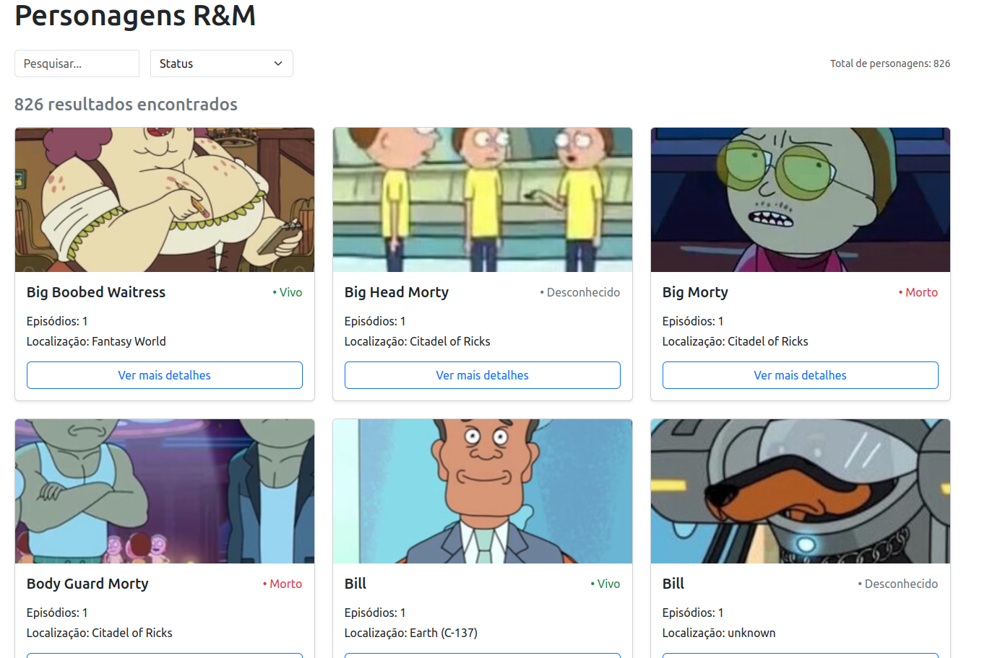
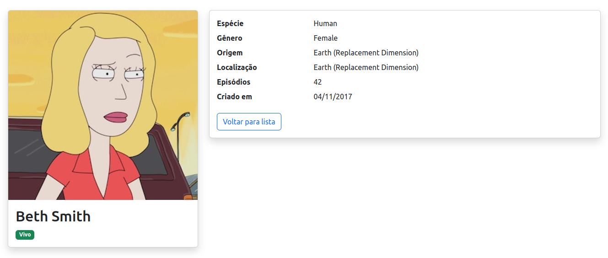

# Rick & Morty Character Explorer

[](https://angular.io/)
[](https://getbootstrap.com/)

A responsive web application for exploring Rick and Morty characters using the [Rick and Morty API](https://rickandmortyapi.com/).

<details>
<summary>Home Image</summary>



</details>

<details>
<summary>Character Details</summary>



</details>

## ✨ Features

- **Character Listing**
  - Dynamic search by name
  - Status filter (Alive/Dead/Unknown)
  - Responsive card grid layout
  - Pagination support

- **Character Details**
  - Detailed character information
  - Episode participation count
  - Origin and location details
  - Responsive image display

- **Optimizations**
  - API response caching
  - Debounced search input
  - Lazy loading of components
  - Efficient state management with Signals

## 🚀 Getting Started

### Prerequisites
- Node.js v18+
- Angular CLI v19+
- Git

### Installation
```bash
# Clone repository
git clone https://github.com/PCDuarte25/rick-and-morty-characters.git

# Install dependencies
cd rick-and-morty-characters
npm install

# Start development server
ng serve
